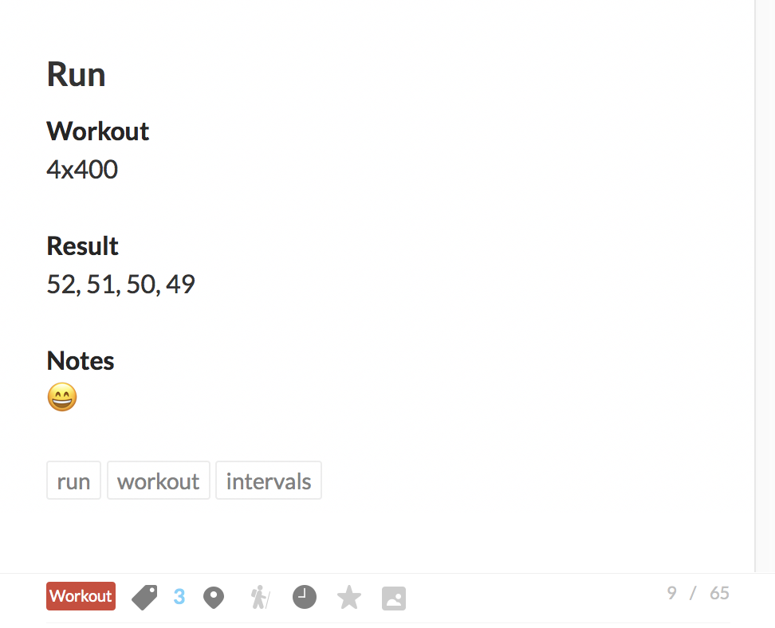

dayone-templates
======================

[DayOne CLI](http://help.dayoneapp.com/command-line-interface-cli/) with template support.

**Note: this only works with DayOne v2.**

[](https://nodei.co/npm/@lukekarrys/dayone-templates/)
[](https://travis-ci.org/lukekarrys/dayone-templates)
[](https://github.com/feross/standard)


## Install

**Prereqs**
```
# Install the dayone2 executable
sudo /Applications/Day\ One.app/Contents/Resources/install_cli.sh
```

**CLI**
```
npm install @lukekarrys/dayone-templates -g
```

**Module**
```
npm install @lukekarrys/dayone-templates --save
```

## Usage

This module is a system for creating DayOne entries that are populated via templates and passing data to those templates.

By default `dayone-templates` will look for templates in `~/.config/dayone-templates`. If you want to point it to somewhere else, use the `dir` option.

So first thing you should do is create some [mustache](https://mustache.github.io/) templates in the templates directory. For this example, let's say there's one in there called `run`.

Templates can have front-matter which can be used to populate the template with default data. When you're creating an entry, you can pass in data which will override that default data.

**~/.config/dayone-templates/run**
```
---
title: Run
tags:
  - run
  - workout
---
# {{title}}

**Workout**
{{workout}}

**Result**
{{result}}

**Notes**
{{notes}}
```

Then you can run the `dayone-templates` command. Specify the `name` of the template you just created, and any additional `tags` you want the entry to have. You can also populate any of the template variables. Also since `title` wasn't passed in, it will use the default `title` from the front-matter.

```sh
dayone-templates \
  --name run \
  --tags intervals \
  --workout "4x400" \
  --result "52, 51, 50, 49" \
  --notes "😄"
```

Then you'll have an entry that looks like this:




## CLI API

_See [the real dayone CLI](http://help.dayoneapp.com/command-line-interface-cli/) for a list of all available options. All those options can be passed to `dayone-templates` as well._

### `name` (required)

`String`

The name of the template to use. This should be a file located inside the `dir` option.

### `dir` (optional, default: `~/.config/dayone-templates`)

`String`

The directory to look for templates in.


### LICENSE

MIT
